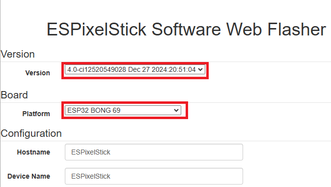
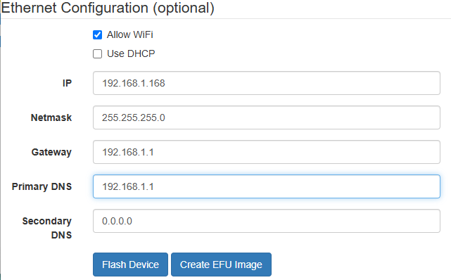
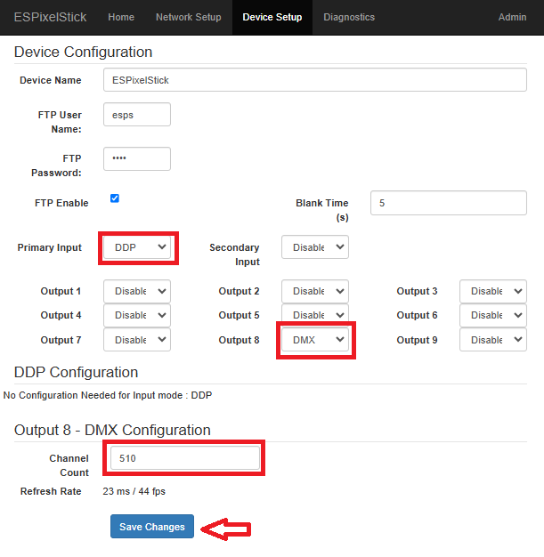
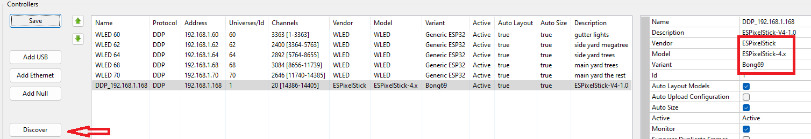
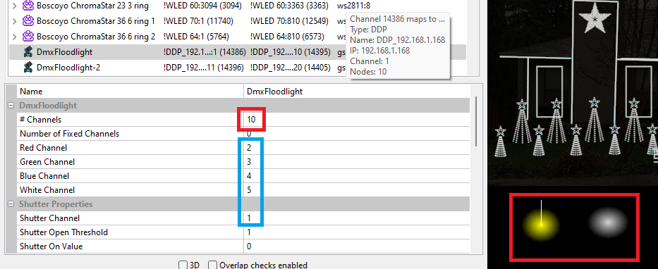
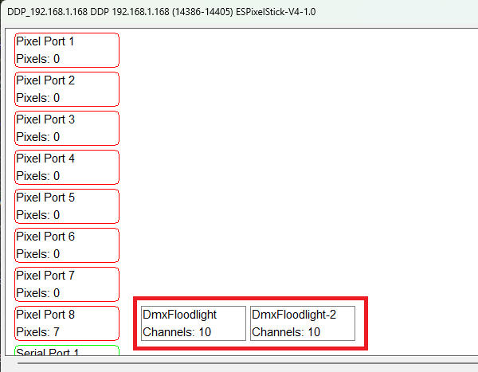
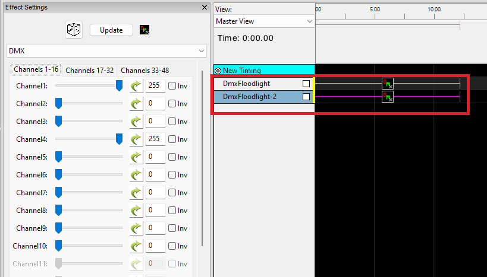

# 8 Port LED Distro DMX Output

DMX Output is posible on the 8 Port LED Distro.  You need to install ESPixelStick firmware.  ESPixelStick allows you to change one of the outputs to use the DMX protocol.

## Hardware setup
Need to add some cool stuff in here about the hardware needed and how to hook it all up. TBD later.

## ESPixelStick Firmware Install
You can use the online installer to install the ESPixelStick firmware on your 8 Port LED Distro.  Use a USB-C cable to connect your 8 Port LED Distro to a computer.  Open a browser to the online installer: https://espixelstickwebflasher.from-ct.com:5000/

- Under verion pick a 4.0 version
- Under platform pick 'ESP32 BONG 69'

- Uncheck use DHCP and give your board an ipaddress, netmask, gateway, and primary dns.
- Press the flash device button.
- Follow the prompts till firmware installation is complete.
- Unplug the USB-C cable.
- Plug in an ethernet cable
- Power up the 8 Port LED Distro
 
## ESPixelStick Setup

- Use a web browser to connect to the board using the ipaddress you gave the board in the previous step.
- Click on the Device Setup tab
- Set the primary input to DDP
- Set output 8 to DMX
- Change channel count to 510
- Press the save button

## DMX Addressing Your Devices
In this example I'm using 2 of the 10 channel [SHEHDS RGBWA+UV](https://shehds.com/products/led-flat-par-7x12w-7x18w-rgbwauv-lighting) LED PARs.  Since this is a 10 channel fixtures i will set the address of the first fixture to address 1 and the second fixture to address 11.  If i had a third fixture it would have address 21 and a forth would have address 31.  The first address must be 1 and the rest of the addresses must be sequential with no gaps between fixtures.

## xLights Settings

- Open xLights
- On the controllers tab click on the discover button
- Click on your newly discovered ESPixelStick device
- Change the model to ESPixelStick-4.x
- Change the Variant to Bong69
- Press the save button

- On the Layout tab, add 2 DMX flood lights to your display
- Set the number of channels to 10
- Set the red, green, blue, white, and shutter to the correct channel number.

- Go back to the controllers tab.
- Select the ESPixelStick device and press the Visualize button
- Drag both Fixtures onto pixel port 8.  make sure they are in the correct order with the DMX address 1 fixture first.

- On the Sequencer tab, start a new animation sequence
- add a DMX thing to each fixture

## Testing
