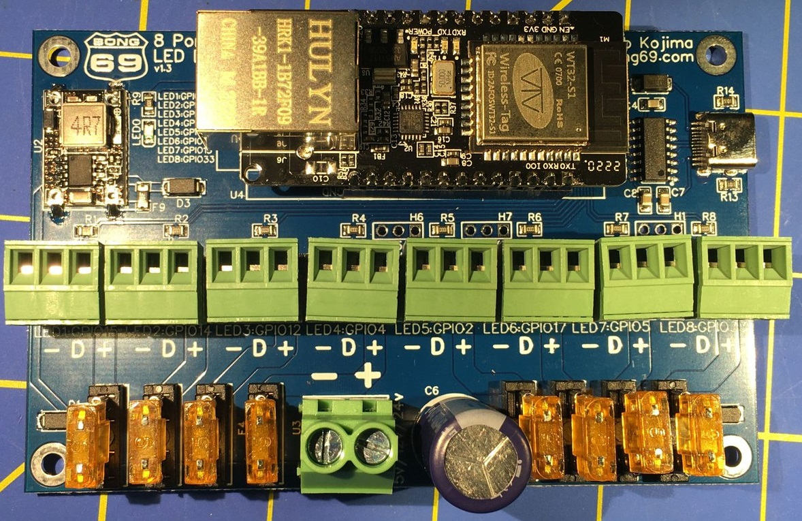

# 8 Port LED Distro

This document will serve as a place to answer questions about the 8 Port LED Distro.

## What is it?
This is an 8 port ESP32 based LED distro board running WLED. Distributing both power and data in 1 board. The WT32-ETH01 provides support for Wi-Fi or ethernet connections. It can be used with either 5v or 12v or 24v LED pixels. Also includes a USB-C port for easy programming.

## Where can I get one?
You can purchase the 8 Port LED Distro in our [Tindie store](https://www.tindie.com/products/27884/).

## How do I hook up a relay?
On the board by the USB-C connector there is a header labeled H1 with 5V, IO32 and GND. IO32 can be used as an output to control an external relay. I would follow this tutorial https://esp32io.com/tutorials/esp32-relay and connect 5V for DC+, GND to DC-, and IO32 to IN. You will have to do some configuration in WLED to tell it what port the relay is on.

## Can a relay be used to turn the board on and off?
No, a relay can not be used to turn the board on and off.  There is only 1 power input for the board if you use a relay to turn the power off the esp32 will also turn off and you will not have a way to tell the relay to turn the board back on.  I personally use the kasa smart plugs to turn my controllers on and off. https://www.amazon.com/Kasa-Smart-Required-Certified-EP10P4/dp/B091FXLMS8 way less wiring hassle and has a really nice web interface for scheduling. I have mine turn on at dusk and off at 11pm every night.

## Can the USB-C connector be used to power the board?
No, the USB-C connector can only be used for programing the board.  When you plug into the USB-C connector the board will go into bootloader mode.  WLED does not work when the board is in bootloader mode.

## What are the dimensions of the board?
110mm x 70mm x 30mm

## Where can I get the STL files for the CG1500 case mount?
STL files can be found on thingiverse https://www.thingiverse.com/thing:5599003

## Where can I get the gerber files for this project?
Sorry the files are not available.  This is not an open source project.
