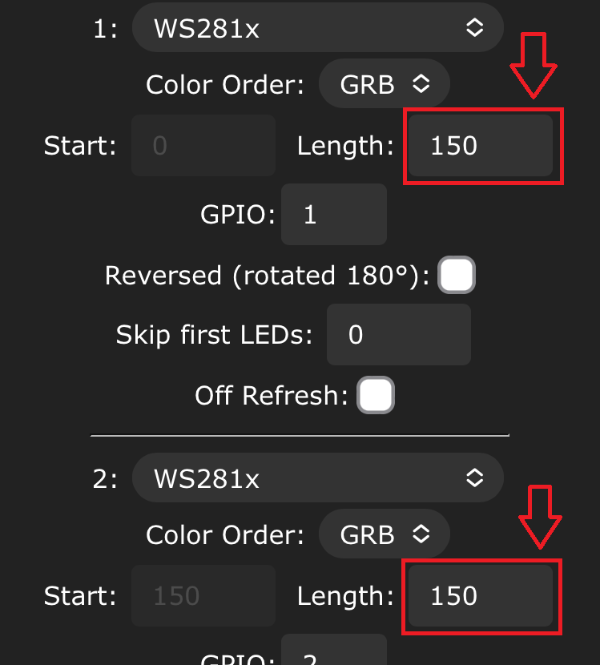
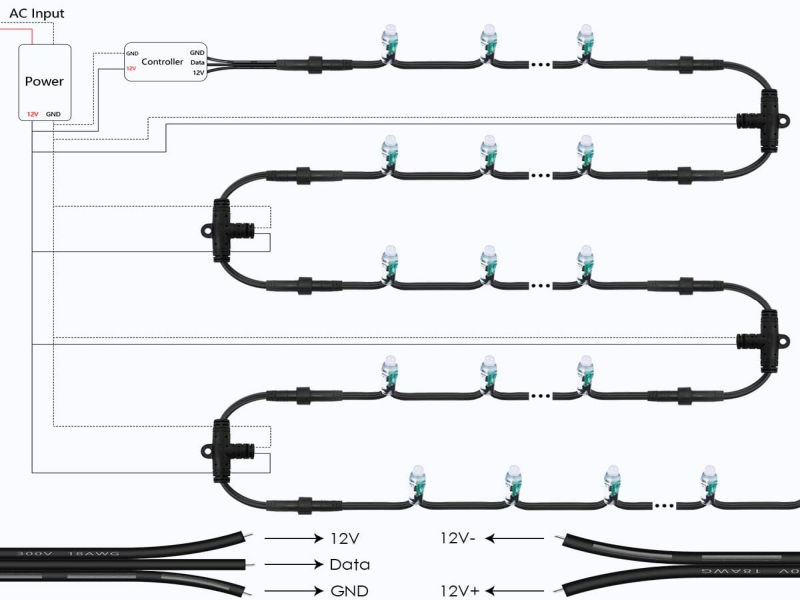

# 8 Port LED Distro


This document will serve as a place to answer questions about the 8 Port LED Distro.

## What is it?
This is an 8 port ESP32 based LED distro board running WLED. Distributing both power and data in 1 board. The WT32-ETH01 provides support for Wi-Fi or ethernet connections. It can be used with either 5v or 12v or 24v LED pixels. Also includes a USB-C port for easy programming.

## Where can I get one?
You can purchase the 8 Port LED Distro in our [Tindie store](https://www.tindie.com/products/27884/).

## What's new in version 2?
- All the components of the WT32-ETH01 have been moved down to the main PCB.
- A new step up/down converter is used to turn 5v, 12v and 24v into 5v needed for the level shifter.
- Improved circuit for making the 3.3v needed by the ESP32 and the ethernet port.
- H1 Header now has 3 GPIO ports so a digital microphone like the INMP441 can be connected.
- H2, H3, and H4 headers are inputs.  They can be used for buttons and temperature sensors.
- Doubled up positive traces for the fuses and phoenix connectors.  There are now 1oz traces on both the top and bottom of the PCB.
- The Ethernet jack now faces up away from the PCB.  The PCB can be put up against something and you can still plug in the ethernet.
- The GPIO mapping for the LED ports has been rearranged.  It should be easier to remember what they are.

## How do I hook up a relay?
On the board by the USB-C connector there is a header labeled H1 with 5V, IO32 and GND. IO32 can be used as an output to control an external relay. I would follow this tutorial https://esp32io.com/tutorials/esp32-relay and connect 5V for DC+, GND to DC-, and IO32 to IN. You will have to do some configuration in WLED to tell it what port the relay is on.

## Can a relay be used to turn the board on and off?
No, a relay can not be used to turn the board on and off.  There is only 1 power input for the board if you use a relay to turn the power off the esp32 will also turn off and you will not have a way to tell the relay to turn the board back on.  I personally use the kasa smart plugs to turn my controllers on and off. https://www.amazon.com/Kasa-Smart-Required-Certified-EP10P4/dp/B091FXLMS8 way less wiring hassle and has a really nice web interface for scheduling. I have mine turn on at dusk and off at 11pm every night.

## Can the USB-C connector be used to power the board?
No, the USB-C connector can only be used for programing the board.  When you plug into the USB-C connector the board will go into bootloader mode.  WLED will not run when the board is in bootloader mode.

## What are the dimensions of the board?
- Version 1: 110mm x 70mm x 30mm
- Version 2: 110mm x 70mm x 25mm

## Where can I get the STL files for the CG1500 / DIN rail mount?
STL files can be found on thingiverse https://www.thingiverse.com/thing:5599003

## I want to make my own mount, what is the hole spacing?
The holes are 3mm x 3mm.  The spacing from outside edge to outside edge is 105mm x 65mm.  


## What are the GPIO pin assignment:

| Port | PCB v1 | PCB v2 |
| ---- | ------ | ------ |
| LED1 | GPIO15 | GPIO1 |
| LED2 | GPIO14 | GPIO2 |
| LED3 | GPIO12 | GPIO3 |
| LED4 | GPIO4 | GPIO4 |
| LED5 | GPIO2 | GPIO5 |
| LED6 | GPIO17 | GPIO12 |
| LED7 | GPIO5 | GPIO14 |
| LED8 | GPIO33 | GPIO15 |

## How do I use audio reactive WLED?
- Download and install this image which is built with ethernet and audio reactive: https://github.com/bobko69/8PortLEDDistro/blob/main/files/WLED_0.14.0_ESP32_Ethernet_AudioReactive.bin
- Wire up your microphone.  This example is for an INMP441 and PCB v2.

| INMP441 | 8 Port LED Distro |
| ------- | ----------------- |
| VDD | 3.3v |
| GND | GND |
| SD | GPIO17 |
| L/R | GND |
| WS | GPIO32 |
| SCK | GPIO33 |

- Configure WLED, goto Settings/UserMods, scroll down to the AudioReactive section.
Place a check next to Enabled, Select 'Generic I2s' for type, set I2S SD to 17, Set I2S WS to 32, set I2S SCK to 33, set squelch to 10, set gain to 30, and press the 'Save' button.  


## Where can I get the gerber files for this project?
Sorry the files are not available.  This is not an open source project.

## How do I compile WLED for this board?
- Follow the PlatformIO compilation guide at [WLED's compilation guide doc](https://kno.wled.ge/advanced/compiling-wled/)
- Open `platformio.ini`
- Make sure that `esp32_eth` is uncommented as `default_envs`
- From here on, you should be able to to build & upload to the board

## How do I update the firmware?
There are a couple of ways to update the firmware on the board.  None of them use the Arduino IDE.

- The easiest way is to connect the board to a computer with the USB-C port and on the computer navigate to [install.wled.me](https://install.wled.me/). Select the version of firmware you want to install and make sure to click the 'Ethernet' button.  Press the Install button and follow the rest of the prompts.  When flashing is done you will see a 'WIFI Configuration' Promt.  DO NOT answer this if you plan on controlling WLED with etherent or with the WLED-AP.

- If you have built or downloaded an image, and if the board is connected to your wifi or ethernet network, from a computer navigate to the WLED page in the board. Click the config button, then click the security and updates button, then click the manual OTA update button.  From here you will be able to select an image file to install.  


- The last way is to connect the board to a computer with the USB-C port and use [esptool](https://github.com/espressif/esptool) to flash the new firmware.  It is a command line tool.  Here is an example command we use when we flash the firmware on the boards: 
```
.\esptool-v4.2.1-win64\esptool.exe write_flash 0x10000 ./WLED_0.14.0-b0_ESP32_Ethernet.bin
```

## How are the GPIO pins assigned?
| Pin | V1 | V2 |
| ------ | -- | -- |
| GPIO00 | EN | EN |
| GPIO01 | USB-RX | LED1 / USB-RX |
| GPIO02 | LED5 | LED2 |
| GPIO03 | USB-TX | LED3 / USB-TX |
| GPIO04 | LED4 | LED4 |
| GPIO05 | LED7 | LED5 |
| GPIO12 | LED3 | LED6 |
| GPIO13 | RMII EMAC RXER | RMII EMAC RXER |
| GPIO14 | LED2 | LED7 |
| GPIO15 | LED1 | LED8 |
| GPIO16 | OSC EN | OSC EN |
| GPIO17 | LED6 | H1 |
| GPIO18 | RMII MDIO | RMII MDIO |
| GPIO19 | RMII EMAC TXD0 | RMII EMAC TXD0 |
| GPIO21 | RMII EMAC TXEN | RMII EMAC TXEN |
| GPIO22 | RMII EMAC TXD1 | RMII EMAC TXD1 |
| GPIO23 | RMII MDC | RMII MDC |
| GPIO25 | RMII EMAC RXD0 | RMII EMAC RXD0 |
| GPIO26 | RMII EMAC RXD1 | RMII EMAC RXD1 |
| GPIO27 | RMII EMAC CRS DV | RMII EMAC CRS DV |
| GPIO32 | H1 | H1 |
| GPIO33 | LED8 | H1 |
| GPIO34 | open | H2 |
| GPIO35 | H6 | H3 |
| GPIO36 | H7 | H4 |
| GPIO39 | open | open |

## Quick start guide:

1. Connect your power supply to the big green connector in the middle of the bottom edge of the board. Connect ground to the '-' side of the connector and +5 or +12 or +24 volts to the '+' side of the connector.
    If you are using 5v LEDs you must use a 5v power supply.
    If you are using 12v LEDs you must use a 12v power supply.
    If you are using 24v LEDs you must use a 24v power supply.
   
		
3. Next connect your LEDs to the phoenix connectors running down the middle part of the board.  The connectors can be unplugged while tightening the screws.  Make sure to connect ground the the '-' side of the connector, positive voltage to the '+' side of the connector, and data to the middle 'd' of the connector.  Check the marking on the PCB by these conectors to make sure you get it right! 

4. Double check to make sure all power and LED wires are connected correctly.

5. Apply power to the board.  The board has been pre configured to run with 50 leds per port.  You should see 50 leds light up on each port you put leds on.
   
6. Use your phone to connect to the WIFI access point in the board.  Look to join a network called 'WLED-AP'.  Use the password 'wled1234'

7. A web page will open up after you are connected.  Press the 'TO THE CONTROLS' button. 

8. Press the effects button and try out all the cool LED effects.

More things you can do:

1. Add the correct number of LEDs you have on each port by going to Config/LED Preferences and changing the length setting on each port. 
 
2. I usually turn off the 'automatic brightness limiter' under Config/LED Preferences, but if you want to play it safe take the amp output of your power supply and multiply it by 1000.  so for a 30amp power supply enter 30000.  (I think this setting is only needed if you power the board and LEDs off of the USB-C port, which you can not do with this board). 
 
3. Enable the ethernet port by going to Config/WiFi setup.  Enter a static IP address and gateway.  Also scroll to the bottom of the page and select 'WT32-ETH01' as the Ethernet Type.  Press save, plug in an ethernet cable, restart the board.  

Im not a WLED expert, if there are other things you want to do there are lots of tutorials on youtube that explain how to join the board to your wifi network, how to make segments, how to make presets, etc.

## How do I set the LED preferences for each port?
This will show how to set up the LED preferences for a Version 2 PCB.  Version 1 PCBs will have different GPIO pins.

1. Press the 'CONFIG" button on the top right of the screen.  Then press  to 'LED Preferences' button.

2. Scroll down to the 'Hardware setup' section. 

3. Next to the '1:' use the drop down to set the type of LED stip you have.

4. Set the  'Color Order'.  Some strips have the colors in different orders.  If the colors you select dont look right, the order can be changed.

5. Set the 'Length', this will be the number ofleds you have connected to the port.

6. Set the 'GPIO' port.  These are listed under the connector on the PCB.  For LED1 the GPIO should be set to 1. List can be found [in this section](https://github.com/bobko69/8PortLEDDistro/blob/main/README.md#what-are-the-gpio-pin-assignment).

Press the '+' button to add more ports and repeat steps 3 thru 6.
Remember to press the 'Save' button when you are done. 

## I no longer see the WLED-AP to connect to
Once you configure the board to connect to your wifi network or you configure the ethernet port and plug in an ethernet cable, the WLED-AP access point will not turn on when you power cycle the board.  There are a few things you can do:

1. If you want to keep accessing the board with the WLED-AP dont configure the wifi to connect to your home network.

2. Unplug the ethernet cable and power cycle.  If the board can not make a network connection with the ethernet, it will turn on the WLED-AP.

3. If you did connect the board to your home wifi, then you should try to access it through your home wifi.  You will need to know the ip address of the board on your network.  Type the ip address into a browser and the configuration page for the board will appear.  Either give the board a static ip address when you configure the wifi setup, or go into your home router and find the ip address assigned to it.

4. If you cant find the ip address of the board, you can download the WLED app to your phone.  There is both an IOS and android version.  The app will poll your home network and find any devices running WLED.  When it finds the board you can connect to it in the app.

## How do I do power injection?
I am not an expert in power injection, and I try to avoid using it.  If a string is getting too long I will split it up and use 2 ports.  First off, you will need a big power supply to power both the 8 Port led distro and a [fuse block like this](https://www.amazon.com/dp/B07GBV2MHN).  The 8 Port LED Distro and the fuse block must be connected to the same power supply.  If you use two power supplies you will have troubles.  Connect power and data from the 8 Port LED Distro to the start of first strip of LEDs in the string.  Connect power from the fuse block to the start of the second strip of LEDs in the string.  Connect power from the fuse block to the start of the 3rd, 4th, 5th, etc... strip of LEDs in the string.  You may need to inject power more often depending on how dense your leds are.


## Can I replace the 5 amp fuses with 10 amp fuses.
You can and that will be fine, but if you are pulling more than 5 amps you probably need to split the string and use 2 ports or you need to use power injection.

## I'm seeing random flickering on some of my LED stings.
Flickering can be caused by many things and can be very hard to diagnose.  It could be from a grounding problem, needing more power injection, a long distance of wire before the first pixel, resistance in the line, or any number of weird unforeseen things.  2 things I have found to work are using data boosters like an [F-amp](https://pixelcontroller.com/store/accessories/53-famp.html) (there are many vendors that sell similar items) and wrapping a ferrite ring on the data line. [ferrite example video](https://www.youtube.com/watch?v=6O5rD1BZeVc) 
